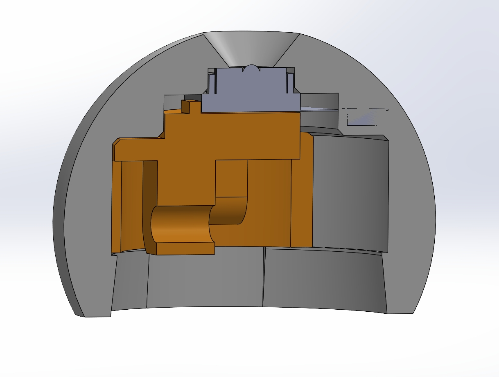

# EyeMech_CAM

**EyeMech_CAM** is the upgraded version, an 8 MP CSI camera has been embedded into the left eye, powered by a Jetson Orin Nano, allowing EyeMech to “see” its external environment through the left‑eye feed. This enhancement opens up new possibilities for vision‑driven animatronics

---

## Demo Video

1. Watch a quick demo of the interface in action: [EyeMech Control Interface demo](https://www.youtube.com/watch?v=Sw0JpN0visc)

## Computer Vision

Use YOLO v11n to make face detection.

## License

This project incorporates original work by Will Cogley licensed under Creative Commons Attribution-NonCommercial-ShareAlike 4.0 International (CC BY-NC-SA 4.0).

You are free to share and adapt this material under the following terms:

* **Attribution**: You must give appropriate credit to the original author (Will Cogley).
* **NonCommercial**: You may not use this work for commercial purposes.
* **ShareAlike**: If you remix or transform this work, you must distribute your contributions under the same license.

If you'd like to use this work in a commercial application, please contact [enquiries@willcogley.com](mailto:enquiries@willcogley.com).

All new code and content added in this repository (GUI, firmware, documentation) are also licensed under CC BY-NC-SA 4.0 to comply with the original share‑alike requirement.
